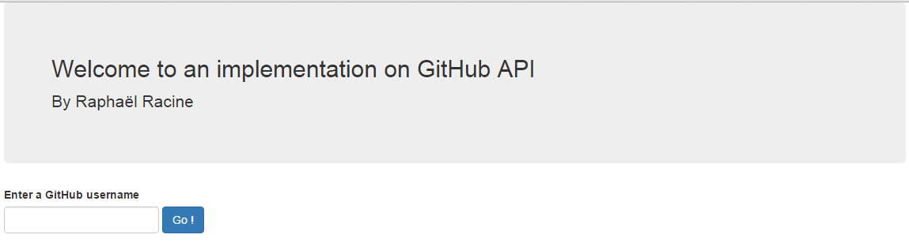
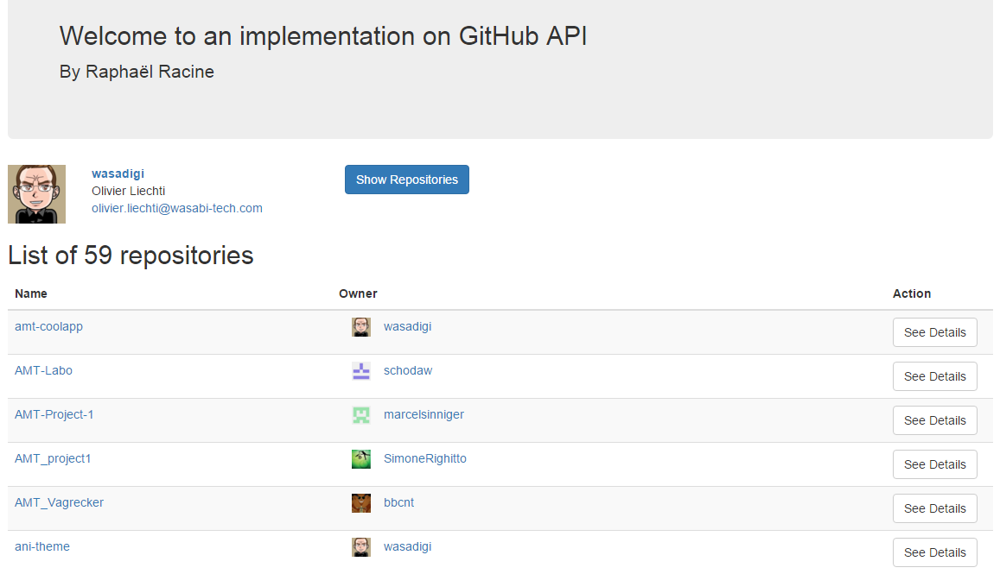
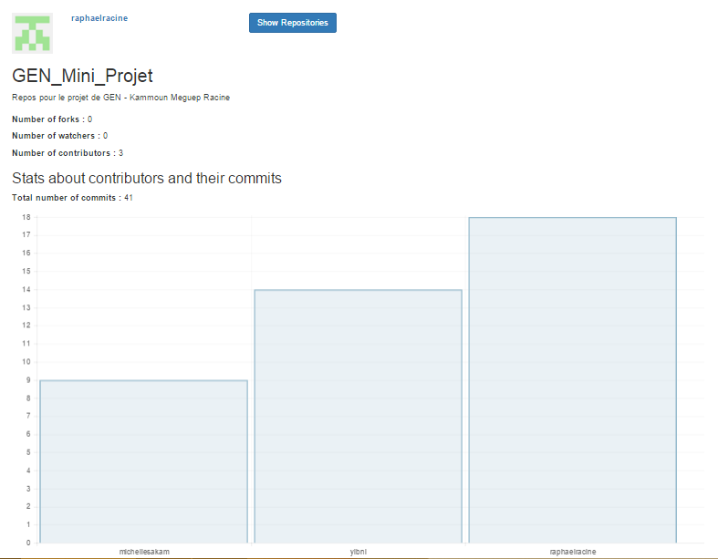
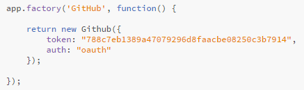

# Welcome to this repository
Welcome to this GitHub repository.

## Introduction

<b>Professor : </b>Olivier Liechti
 <b>Student : </b>Raphaël Racine

This repository is used for TWEB Test 2 at HEIG-VD school.

## Choosen Topic
The topic I have chosen is one where we have to use the API GitHub.

## Studies API GitHub
[Here](https://developer.github.com/v3/) we can find the documentation about the API version 3.

So, I have decided to use the <b>npm github-api</b> to have a wrapper around this GitHub API.

### Use of token
To avoid problems with requests limits, i have created a token on my GitHub account with no rigths (only do GET on some URL of the API) and i have set it in my Angular application.

### Using GitHub API with npm
You can find documentation to use GitHub API with the following npm module : [github-api](https://github.com/michael/github)

## Choice of functionality
I have chosen following functionalities :
<li> Check the list of repo of a user
<li> Then, consult a repo and have the number of commits per contributor

## Deploiement on Heroku
I have published my app to heroku ([https://test2racine.herokuapp.com](https://test2racine.herokuapp.com) to see it).

## Realisation
### Server
I used express for my server.

My server has a controller called <b>home.js</b> which serves the index page.

That's all that my server do.

<i><b>Note:</b> I could have only static content (no express server), but I thought it after too later. But it can be good if one day i want to improve the application with a database for example.</i>

### Client
So on the client-side i used Angular as requested.

I called my angular module <b>Test2Module</b> and i have attached some elements, explained immediately. 

#### Dependancies with other Angular modules
I have 2 dependancies with other Angular modules :
<li><b>UI-Router</b> I have installed it with <b>bower install --save angular-ui-router</b> and the concerned javascript files are in <b>public/components/angular-ui-router</b>. I need this module to manage the navigation of my application.

<li><b>Chart.js</b> I have installed it with <b>bower install --save angular-charts</b> and the are places into <b>public/components/Chart.js</b> and <b>public/components/angular-chart</b>. I need this module to draw charts in my application.

#### User Interface
Here i present the interfaces i have created and i comment it the structure and how i have implemented that with Angular.

##### Welcome
This is where the user arrives when he arrive to the application.

UI-Router state : 'welcome'  (url : /welcome)

Concerned static view file : public/partials/home.html.

On this view, we can entry a username of GitHub and then click go to see the list of repositories of this user.

##### User Repositories
This is the view where we see the list of repositories of a GitHub user.

UI-Router state : /user/{username}/repositories

Concerned static view file : public/partials/repositories.html

On this view we can see the list of repositories of a user.

There is some functionnalities here :
<li> We can send an e-mail to the user shown in the top of the page
<li> We can see informations about the user on GitHub by clicking the name of the user (user in top of the page, or an owner of a repo)
<li> We can see informations about a repo on GitHub by clicking on the name of this repo (in left column of the table)
<li> We can see details about a repo by clicking the button See Details

##### Some details of a repository
This is the view where we see details about a repository.

UI-Router state : /user/{username}/repositories/{repositoryName}

Concerned static view file : public/partials/repository.html

On this view we can see some informations about the repo :
<li> In the top on the page, we see the owner of the repo
<li> The title and the description of the repo are shown
<li> We see the number of forks, the number of watchers and the number of contributors
<li> Finally, we have a histogram which indicates the number of commit per contributors

#### Using GitHub API with github-api installed with NPM
In my Angular module, i have attached a factory which is return a GitHub object (a wrapper) which allow me to do request on GitHub API, like this :

I need to pass my token created on my GitHub account.

## Conclusion

This exercise have an interest for me because i have discovered how to use the GitHub API through a wrapper with Angular, i found that very nice and I have improved my experience in Angular.

